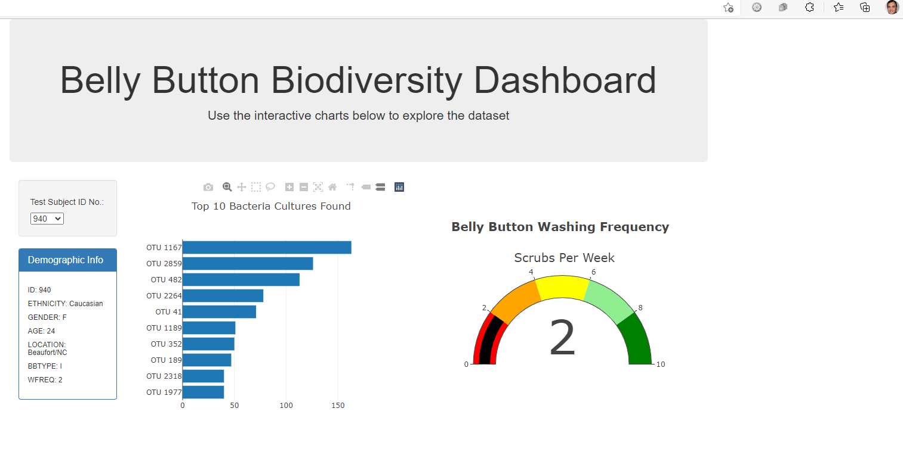

## Project Owner: Roza- University Researcher

## Project Manager: Nayan Patel

## Project: Belly Button Biodiversity!

Using Plotly.js, a JavaScript data visualization library, to create an interactive data visualization for the web.

## Project Scope:

Needs to visualize the bacterial data for each volunteer. Specifically, and should be able to identify the top 10 bacterial species in their belly buttons.

if Improbable Beef identifies a species as a candidate to manufacture synthetic beef, Volunteers will be able to identify whether that species is found in their navel.

## Project Deliverables:

Deliverable 1: Create a Horizontal Bar Chart

Deliverable 2: Create a Bubble Chart

Deliverable 3: Create a Gauge Chart

Deliverable 4: Customize the Dashboard

## Project Data Source:

Plotly

d3.json

bootstrap

css

## Summary

Deliverable 1:

Create a Horizontal Bar Chart:

Using your knowledge of JavaScript, Plotly, and D3.js, create a horizontal bar chart to display the top 10 bacterial species (OTUs) when an individual’s ID is selected from the dropdown menu on the webpage. The horizontal bar chart will display the sample_values as the values, the otu_ids as the labels, and the otu_labels as the hover text for the bars on the chart.

Deliverable 2:

Create a Bubble Chart:

Using JavaScript, Plotly, and D3.js, create a bubble chart that will display the following when an individual’s ID is selected from the dropdown menu webpage

Deliverable 3:

Create a Gauge Chart:

Using JavaScript, Plotly, and D3.js, create a gauge chart that displays the weekly washing frequency's value, and display the value as a measure from 0-10 on the progress bar in the gauge chart when an individual ID is selected from the dropdown menu.

Deliverable 4:

Customize the Dashboard :

Using HTML and Bootstrap to customize the webpage for your dashboard.

